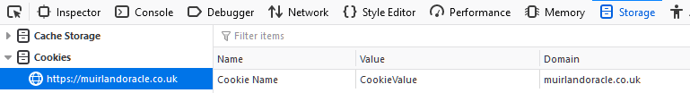
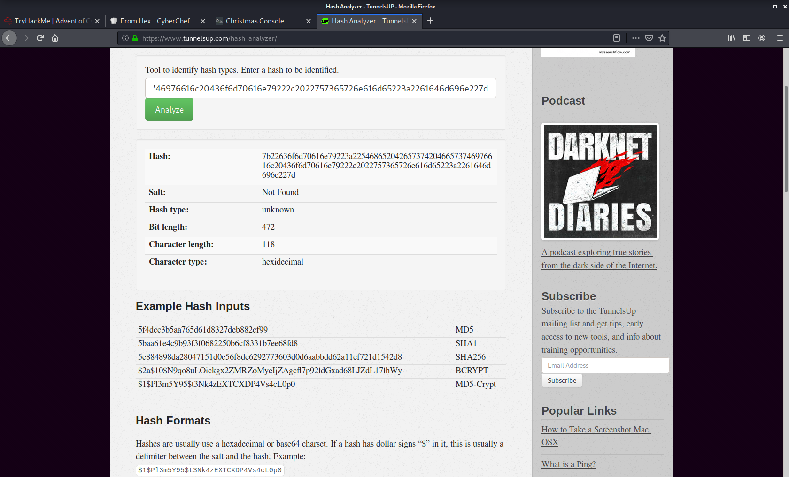
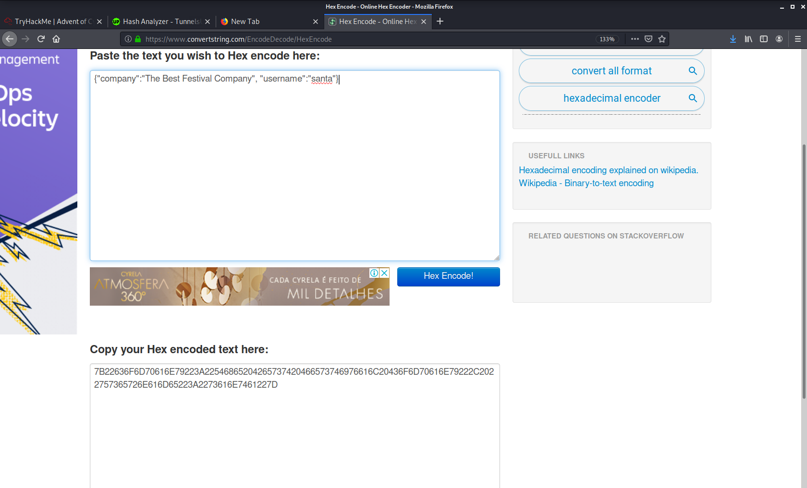
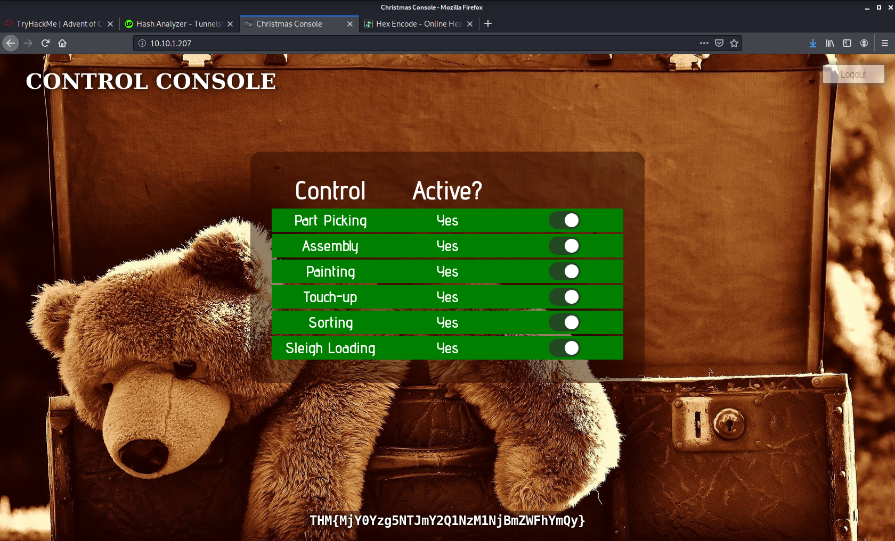

# Advent-of-Cyber-2020

Tryhackme event Advent of Cyber 2020 !!!

# 1-web exploitation 

## 1-No answer needed

## 2-what is the name of the cookie  for authentication?
### press F12 

### auth
 
## 3-In what format the value of cookie is encoded?
 

 
## Hexadecimal
 
## 4-Having decoding the cookie in what format data is stored in ?
## Json(after decoding we get {"company":"The Best Festival Company", "username":"admin"})
 
### 5-What is the value of santa cookie?
 

 
#### 7B22636F6D70616E79223A22546865204265737420466573746976616C20436F6D70616E
#### 79222C2022757365726E616D65223A2273616E7461227D

## 6-After reactivating the assembly line what is the flag you are given?

### THM{MjY0Yzg5NTJmY2Q1NzM1NjBmZWFhYmQy}

