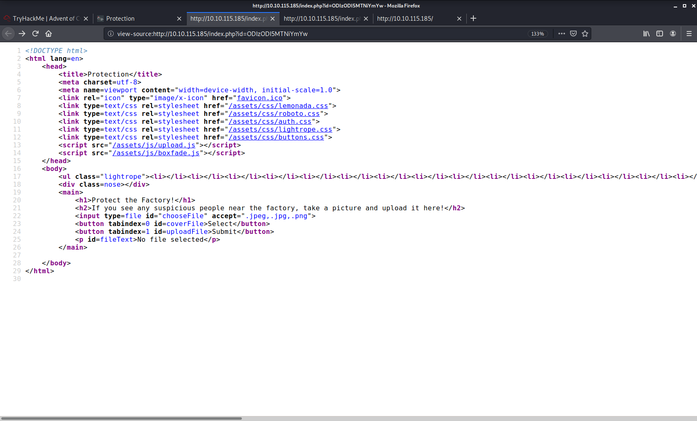

# Advent-of-Cyber-2020

Tryhackme event Advent of Cyber 2020 !!!

# 1-web exploitation 
### 1-No answer needed
### 2-what is the name of the cookie  for authentication?
### press F12 

### auth

## 3-In what format the value of cookie is encoded?

## Hexadecimal
## 4-Having decoding the cookie in what format data is stored in ?
## Json(after decoding we get {"company":"The Best Festival Company", "username":"admin"})
 
### 5-What is the value of santa cookie?

#### 7B22636F6D70616E79223A22546865204265737420466573746976616C20436F6D70616E
#### 79222C2022757365726E616D65223A2273616E7461227D

## 6-After reactivating the assembly line what is the flag you are given?

### THM{MjY0Yzg5NTJmY2Q1NzM1NjBmZWFhYmQy}

# 2- Web Exploitation (The Elf Strikes back)

### 1-What string of text needs added to the URL to get access to the upload page?
->?id=ODIzODI5MTNiYmYw

actual url path http://<ip>/index.php?id=ODIzODI5MTNiYmYw

### 2-What type of file is accepted by the site?
->image

### 3-in which directry upload files are stored
[: payload works = <reverse-shell-file>.png.php]
/uploads/{use gobuser or dirbuster}

#### 4-no answer needed

### 5-What is the flag in /var/www/flag.txt?
#### THM{MGU3Y2UyMGUwNjExYTY4NTAxOWJhMzhh}
